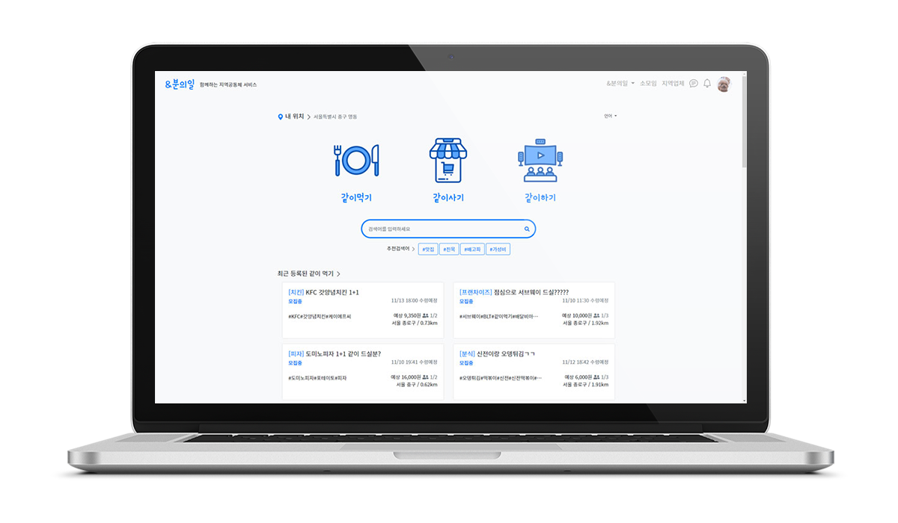
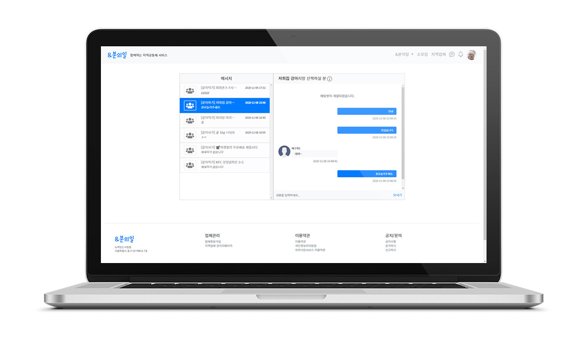
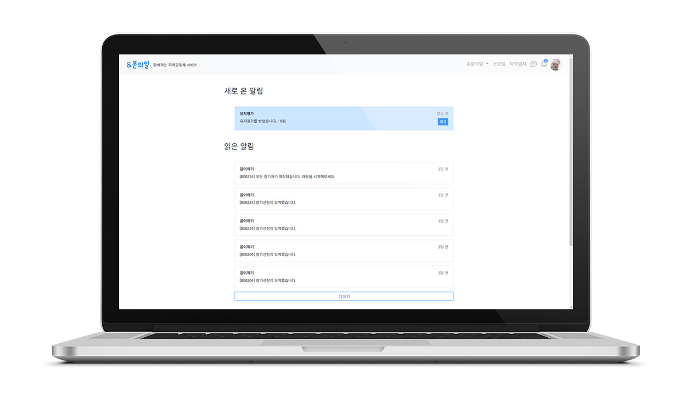
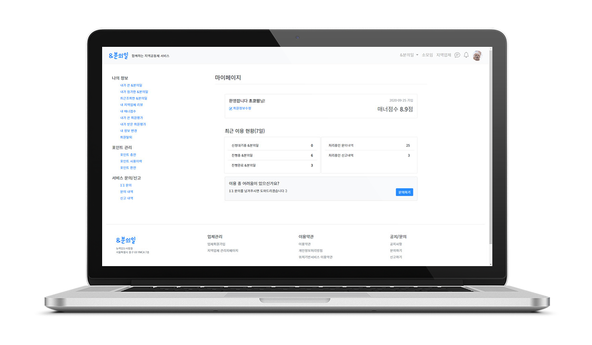
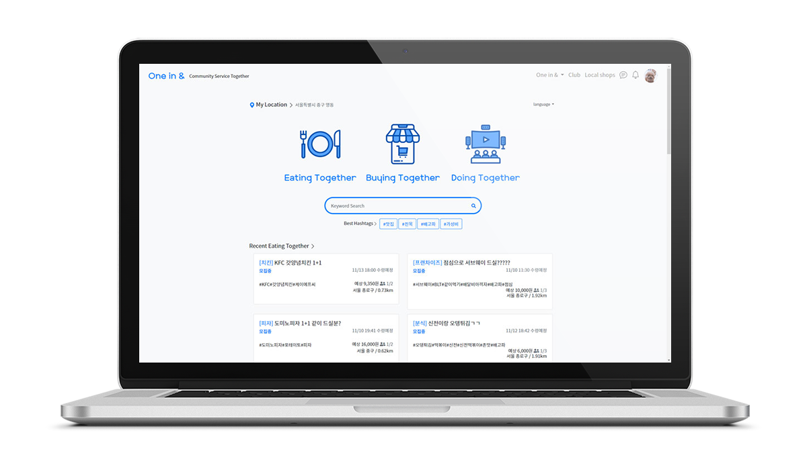
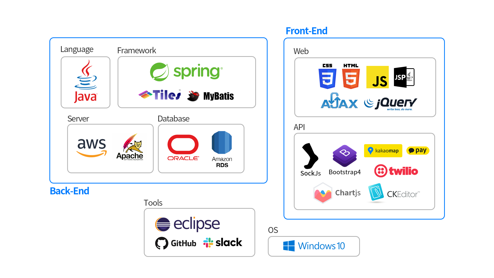

    
&amp;분의일

    
함께하는 지역공동체 서비스

    
2020.09 ~ 2020.11

<!-- Swiper -->

    

    

    

    

    

    

    

    

    

    

    <!-- Add Pagination -->
    

    <!-- Initialize Swiper -->

  

> 함께하는 지역공동체 서비스를 컨셉으로 N분의 1로 나누고, AND, 함께한다는 중의적 의미를 담고 있습니다. 물건을 함께 사고 나누는 것뿐만 아니라, 한걸음 나아가 함께하는 위치 기반 소모임 서비스를 제공하고 우리동네지역 업체들의 정보와 리뷰 서비스도 제공하여 진정한 의미의 함께하는 지역공동체 서비스를 지향하고 있습니다

<i class="fab fa-github"></i> **Github**  <a href="https://github.com/stothey0804/andOne">link</a> 

  

### 사용기술

- 위치기반 서비스
- 포인트 충전을 이용한 선결제 서비스
- 다자간 채팅 기능

#### 기술스택

  

### 담당역할

_Full-stack Developer, 팀장._

- 회원 기능 전체(가입,문의,신고,평가) CRUD
- 비밀번호 찾기를 위한 메일발송과, 회원인증을 위한 SMS전송 구현.
- 웹소켓을 이용한 알림 기능을 구현했습니다.
- 간편결제 API를 이용한 포인트 충전기능을 구현했습니다.
- 맵 API를 이용하여 위치정보를 사용하기 위한 공통 js파일을 작성했습니다.
- 공통 기능을 수행하는 Common Class를 작성했습니다.
- chart js를 통해 쿼리로 조회한 통계정보를 시각화했습니다.
- 부트스트랩을 이용하여 CSS 마무리 작업을 했습니다.

  

### 시연동영상
  
<iframe src="https://player.vimeo.com/video/478288917" width="640" height="360" frameborder="0" allow="autoplay; fullscreen" allowfullscreen></iframe>
  
<iframe src="https://player.vimeo.com/video/478368662" width="640" height="360" frameborder="0" allow="autoplay; fullscreen" allowfullscreen></iframe>
  
<iframe src="https://player.vimeo.com/video/478288811" width="640" height="360" frameborder="0" allow="autoplay; fullscreen" allowfullscreen></iframe>
  
<iframe src="https://player.vimeo.com/video/478288848" width="640" height="360" frameborder="0" allow="autoplay; fullscreen" allowfullscreen></iframe>
  
<iframe src="https://player.vimeo.com/video/478288932" width="640" height="360" frameborder="0" allow="autoplay; fullscreen" allowfullscreen></iframe>
